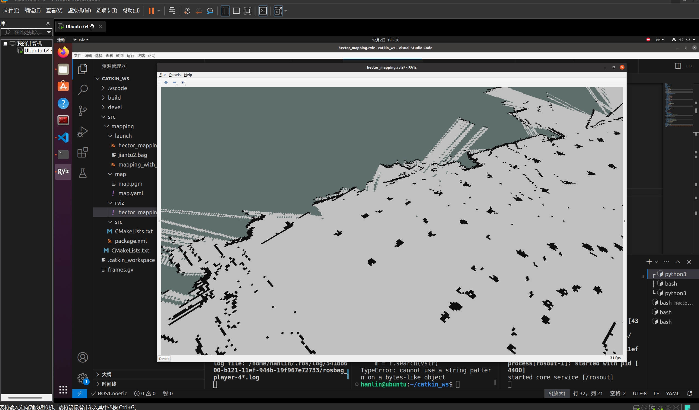

# README--这是一封readme

## 这应该也是我今年写的最后一封README

亲爱的yjb学长姐姐：

    您好！
    
    我怀着真挚而又平和的心情写下这一封readme，也算是为我前三个月的故事画上一个句号。

    感谢这段时间来你对我的所有帮助，感谢你经常在半夜给予我的鼓励和教导，感谢你时不时的招呼，也感谢你为所有招新培训做出的努力，感谢你为我考虑留下大创的机会。

    凌晨发布的考核题，我看了。我知道，我要是完成它不难，我在短期内速成应对面试也不难，但是，我知道，这不是招新的初心。所以，我重拾我学习的本心，尝试挑战自己的潜力，我发现，我做不到。别说线下验收的两道题，就连第一道，在上次代码基础上进行修改的，我都是花费了半个多小时才堪堪能让它显示出凌乱的建图。

    
    
    这次，我真的放下了。我确实应该放过我自己。也许，我真的不适合这一条路，我没有基础，没有天赋，只有初生牛犊不怕虎的无畏，但是，竞赛等不起时间。我觉得，我确实没办法两者兼顾，我的数学、我的英语、我的其他作业也需要时间。所以，我郑重地说，我打算放弃这次最终考核的机会，希望你在剩下优秀的成员中挑选到你心仪的队友，也祝你们明年的谢幕之旅顺利！